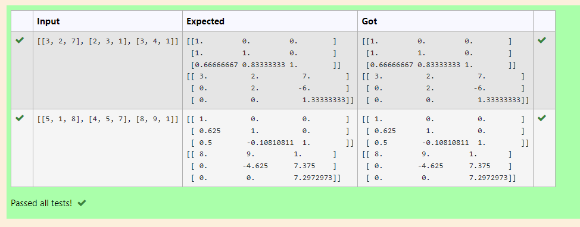
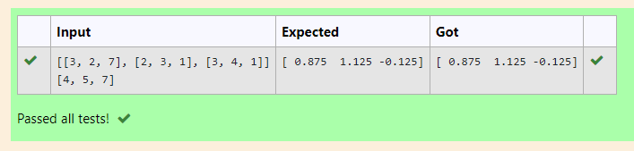

# Use LU Decomposition to find L and U matrix.

## AIM:
To write a program to find the LU Decomposition of a matrix.

## Equipments Required:
1. Hardware – PCs
2. Anaconda – Python 3.7 Installation / Moodle-Code Runner

## Algorithm:
1. Import numpy as np.
2. Get the matrix values from the user as input.
3. Use linalg functions for calculation.
4. Calculate L and U matrices.
5. Display the result.

## Program:
~~~
'''Program to find L and U matrix using LU decomposition.
Developed by: Syed Abdul Wasih H
RegisterNumber: 21002291
'''
# To print L and U matrix
import numpy as np
from scipy.linalg import lu
A=np.array(eval(input()))
P,L,U=lu(A)
print(L)
print(U)
~~~

## Output:

## Result:
Thus the program to find the LU Decomposition of a matrix is written and verified using python programming.

# Use LU Decomposition to solve a matrix.

## AIM:
To write a program to find a solution of a matrix using LU Decomposition.

## Equipments Required:
1. Hardware – PCs
2. Anaconda – Python 3.7 Installation / Moodle-Code Runner

## Algorithm
1. Import numpy as np.
2. Get the matrix values from the user as input.
3. Use linalg functions for calculation.
4. Solve the matrix.
5. Display the result.

## Program:
~~~
'''Program to solve a matrix using LU decomposition.
Developed by: Syed Abdul Wasih
RegisterNumber: 21002291
'''
# To print X matrix (solution to the equations)
import numpy as np
from scipy.linalg import lu_factor,lu_solve
A=np.array(eval(input()))
B=np.array(eval(input()))
lu,pivot=lu_factor(A)
x=lu_solve((lu,pivot),B)
print(x)
~~~
## Output:

## Result:
Thus the program to find the LU Decomposition of a matrix is written and verified using python programming.

